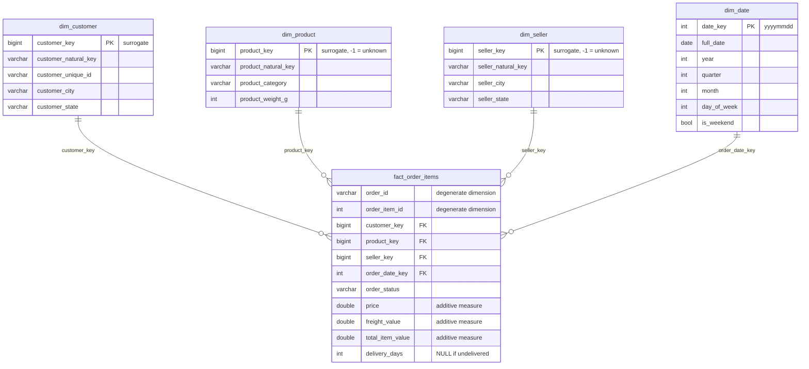

# Project 1.1 — Star Schema with Olist E-Commerce

> **Guided Project** from Phase 1 of the DE Playbook.
> Concepts: dimensional modeling, grain declaration, surrogate keys, star schema, unknown members, additive vs. non-additive measures.

🎫 **Learning by doing? Start with [SCENARIO.md](SCENARIO.md), build via [BUILD_GUIDE.md](BUILD_GUIDE.md), then study [EXPLANATION.md](EXPLANATION.md) line by line.**

## What this project builds

Profiles 8 raw e-commerce CSVs (Olist Brazilian E-Commerce schema), then reshapes them from OLTP shape into an OLAP **star schema** in DuckDB, and answers 10 business questions against it.

## ER Diagram



## How to run

```bash
# 1. Create the raw CSVs (or place the real Kaggle Olist CSVs in data/raw/)
python generate_sample_data.py

# 2. Load raw tables, profile them, build dims + fact, validate
python build_star_schema.py

# 3. Run the 10 analytical queries
python run_queries.py
```

## Design decisions (the part interviewers ask about)

### 1. Grain — declared before any SQL was written
**One row in `fact_order_items` = one item line within one order.**
An order with 3 items = 3 fact rows. Chosen because it is the *lowest* useful grain: you can always roll up to order level (see Q8), but you can never drill down below the grain you stored.

### 2. Star, not snowflake
Each dimension is one flat, denormalized table. `dim_customer` carries city *and* state directly instead of normalizing into a `dim_geography` sub-dimension. With columnar storage (DuckDB), the redundancy is nearly free and every query saves a join.

### 3. Surrogate keys everywhere
Every dimension gets an integer `*_key` generated by `ROW_NUMBER()`. The Olist 32-char hex IDs are kept as `*_natural_key` for traceability but never used as PKs. Reasons: natural keys change when source systems migrate, integers join faster, and surrogate keys are the mechanism that makes SCD Type 2 possible later (Project 1.3).

### 4. Unknown member (key = -1)
`dim_product` and `dim_seller` each contain a row with surrogate key **-1**. Fact rows that fail to match a dimension are routed there via `COALESCE(dim.key, -1)` instead of being silently dropped by an inner join. This is the standard defense against **late-arriving dimensions**.

### 5. `dim_date` built from scratch
Generated as a continuous day series spanning the order date range, with `yyyymmdd` integer keys. The date dimension is the highest-leverage dimension in any warehouse — every "by month / weekday / weekend" question (Q3, Q4, Q9, Q10) is a single join.

### 6. Additive vs. non-additive measures
`price`, `freight_value`, `total_item_value` are **additive** — safe to SUM across any dimension. The freight *ratio* (Q2) is **non-additive**: it is always recomputed as `SUM(freight)/SUM(price)`, never averaged, because an average of ratios weights a R$10 order the same as a R$10,000 one.

### 7. Degenerate dimensions
`order_id` and `order_item_id` stay on the fact table. They have no descriptive attributes of their own, so a `dim_order` table would contain nothing but keys — pure overhead.

### 8. Fan-trap awareness
`raw_payments` and `raw_reviews` are loaded but deliberately **not** joined into the item-grain fact: payments are *order*-grain (1 row per order), so joining them onto items would multiply payment values by the item count — a classic fan trap. The right move (Assignment 1.1 territory) is a separate order-grain fact table.

## Deliverables checklist

- [x] ER diagram (above, Mermaid)
- [x] Python loader script (`build_star_schema.py`) with profiling + validation gates
- [x] 10 analytical queries (`analytical_queries.sql`), all one join hop from fact to dim
- [x] README with design decisions (this file)
